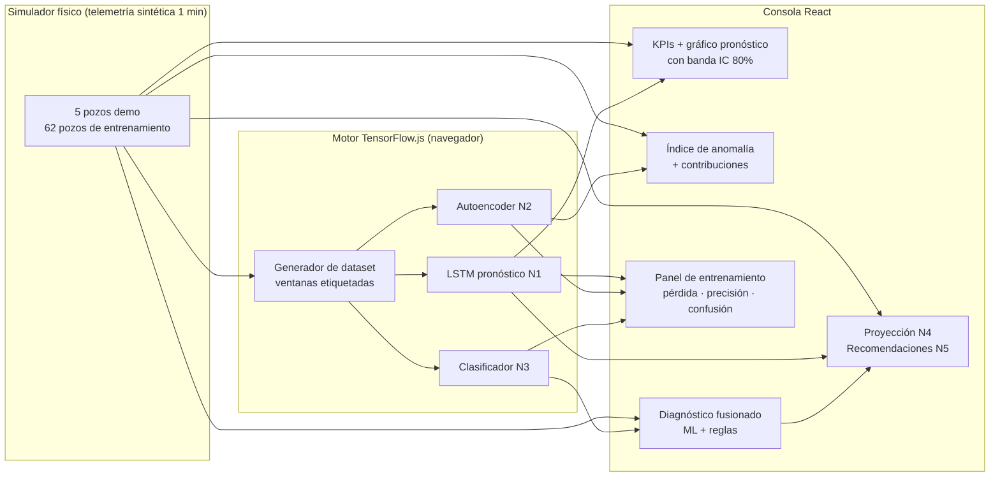

<div align="center">

# VIGÍA ML

**Consola predictiva de pozos de gas con Machine Learning en el navegador**

[](https://react.dev)
[](https://www.typescriptlang.org)
[](https://www.tensorflow.org/js)
[](https://vitejs.dev)
[](https://tailwindcss.com)
[](LICENSE)

*Pronóstico LSTM · Detección de anomalías con autoencoder · Clasificación de fallas con red neuronal — todo entrena y ejecuta **en vivo** en tu navegador, sin servidor.*

</div>

---

## ¿Qué es VIGÍA ML?

VIGÍA ML es una consola de operación para campos de gas que combina **tres modelos de machine learning** con un pipeline de análisis de telemetría SCADA (1 min por muestra). A diferencia de un dashboard tradicional, aquí los modelos **entrenan en tu navegador al abrir la página** (TensorFlow.js/WebGL) y luego asumen el control del pipeline analítico capa por capa, con **fallback estadístico** garantizado mientras tanto.

La telemetría es **sintética**: un simulador físico de pozos genera series minuto a minuto con regímenes operativos inyectables (liquid loading, restricción en línea, falla de sensor, problema de actuador), lo que permite demostrar el ciclo completo *datos → entrenamiento → inferencia → recomendación* sin datos reales de campo.


## Pipeline analítico (N1 → N5)

| Capa | Función | Motor ML | Fallback estadístico |
|------|---------|----------|----------------------|
| **N1 · Pronóstico** | Proyección multivariada a 6/12/24 h con IC 80% | **LSTM(28)** sobre agregados de 15 min, rollout recursivo de 6 pasos | Holt amortiguado (α=0.32, β=0.11, φ=0.93) |
| **N2 · Anomalías** | Índice 0–100 por pozo con contribuciones por variable | **Autoencoder denso** 180→72→20→72→180, error de reconstrucción calibrado en validación | z-score multivariable, ventana 120 min |
| **N3 · Diagnóstico** | Hipótesis de falla con evidencia física | **Clasificador denso** 14→32→16→5 softmax entrenado con ~1.4k ventanas etiquetadas | Reglas físicas v2.4 (23 patrones) |
| **N4 · Proyección** | P(cruce de umbral en 24 h) + hora estimada | Monte Carlo analítico sobre el pronóstico del LSTM | Ídem sobre Holt |
| **N5 · Recomendaciones** | Acciones operacionales priorizadas (ALTA/MEDIA/RUTINA) | Derivadas del diagnóstico fusionado ML + reglas | Ídem |

### Los tres modelos en detalle

1. **LSTM de pronóstico (N1)** — Recibe ventanas de 16 pasos × 6 variables (P tubing, P casing, P línea, temperatura, caudal, choke) normalizadas por pozo y predice los siguientes 6 pasos de 15 min para las 6 variables a la vez (36 salidas). Para horizontes largos aplica *rollout recursivo*: realimenta sus propias predicciones. La incertidumbre se calibra con la σ de residuales por (paso, variable) medida en validación, y crece con √(bloques de rollout).

2. **Autoencoder de anomalías (N2)** — Entrena **solo con operación normal** para reconstruir ventanas de 30 min. En producción, el error de reconstrucción se convierte en score 0–100 mediante la distribución (μ, σ) del error en validación. Las contribuciones por variable revelan *qué señal* está anómala. Un detector de señal congelada complementa al AE (una señal plana es trivial de reconstruir pero es falla clara del transmisor).

3. **Clasificador de diagnóstico (N3)** — Extrae 14 features físicas por ventana de 90 min (tendencias por hora, diferenciales de presión, oscilación de caudal, recorrido del choke, planitud de señal, spikes…) y las pasa por una red softmax de 5 clases. Su salida se **fusiona con las reglas físicas**: la red da la probabilidad, las reglas aportan la evidencia textual que el operador puede auditar.

### Dataset de entrenamiento

Se generan **62 pozos sintéticos** con bases operativas aleatorias y regímenes inyectados en minute aleatorio. De cada pozo se extraen ~800 ventanas de pronóstico, ~1.0k ventanas normales (autoencoder) y ~1.4k ventanas etiquetadas (clasificador), con split train/validación **por pozo** para evitar fuga de datos y balanceo de la clase normal. Todo determinista (seed fija).

## Demo rápida

```bash
git clone https://github.com/TU_USUARIO/vigia-ml.git
cd vigia-ml
npm install
npm run dev          # abre http://localhost:3000
```

Al abrir la consola verás:

1. **El panel "Motor de aprendizaje"** entrena los 3 modelos en vivo (10–20 s con WebGL; más lento si el navegador cae a CPU). Curva de pérdida, épocas y precisión en tiempo real.
2. Cada modelo **toma el control de su capa** al terminar (los chips `LSTM · TF.JS` se encienden en N1/N2/N3).
3. Con el motor listo, la **matriz de confusión** y las métricas de validación quedan visibles; puedes **reentrenar** con un clic.
4. Selecciona un pozo y **inyecta un régimen** (p. ej. *Liquid loading*): en ~1 minuto el clasificador ML lo detectará con su probabilidad, el autoencoder subirá el índice de anomalía y N5 propondrá acciones.


## Arquitectura



```
src/
├── lib/
│   ├── sim.ts                 # simulador físico de pozos + flota demo
│   ├── models.ts              # pipeline estadístico (Holt, z-score, reglas, N4/N5)
│   └── ml/
│       ├── dataGen.ts         # dataset de entrenamiento (ventanas etiquetadas)
│       └── engine.ts          # motor TF.js: 3 modelos + entrenamiento + inferencia
└── components/
    ├── ForecastChart.tsx      # N1 · historia + pronóstico LSTM/Holt con IC
    ├── InsightPanels.tsx      # N2 · medidor de anomalía + calidad de datos
    ├── RightRail.tsx          # N3/N4/N5 · diagnóstico, proyección, recomendaciones
    ├── TrainingPanel.tsx      # ML · entrenamiento en vivo + matriz de confusión
    └── ...                    # TopBar, WellRail, KpiGrid, bits
```

## Scripts

| Comando | Descripción |
|---------|-------------|
| `npm run dev` | Servidor de desarrollo (Vite, puerto 3000) |
| `npm run build` | Build de producción (`dist/`) |
| `npm run preview` | Sirve el build de producción localmente |
| `npm run typecheck` | Verificación de tipos TypeScript |

## Detalles técnicos

- **Backend de cómputo**: TensorFlow.js selecciona WebGL automáticamente; si no está disponible cae a CPU y las épocas se reducen para mantener un tiempo de entrenamiento razonable.
- **Memoria**: todos los tensores de inferencia se liberan tras cada ciclo (1.5 s); los modelos viven durante toda la sesión y se liberan al reentrenar o desmontar.
- **Degradación elegante**: si la inferencia ML falla o el motor aún entrena, cada capa usa su gemelo estadístico — la consola nunca se queda sin análisis.
- **Reproducibilidad**: el dataset usa semillas fijas; con el mismo navegador obtendrás las mismas curvas de entrenamiento (salvo la no-determinidad propia de WebGL).
- **Normalización por pozo**: cada modelo normaliza las variables respecto a la base operativa del pozo (escala relativa por variable), lo que permite entrenar con pozos sintéticos y aplicar a pozos con bases distintas.

## Limitaciones (honestidad ante todo)

- La telemetría es **sintética**: los niveles de precisión mostrados (≥95% en validación) reflejan la separabilidad de los regímenes del simulador, no la de un campo real.
- Un modelo supervisado de *falla en X horas* con datos reales requiere históricos de intervenciones documentadas.
- El rollout recursivo del LSTM acumula deriva a 24 h; las bandas de confianza crecen con √(bloques) para reflejarlo.

## Licencia

[MIT](LICENSE)

---

<div align="center">
<sub>VIGÍA ML v0.5 · Telemetría sintética con fines de demostración · Entrena, vigila, recomienda.</sub>
</div>
