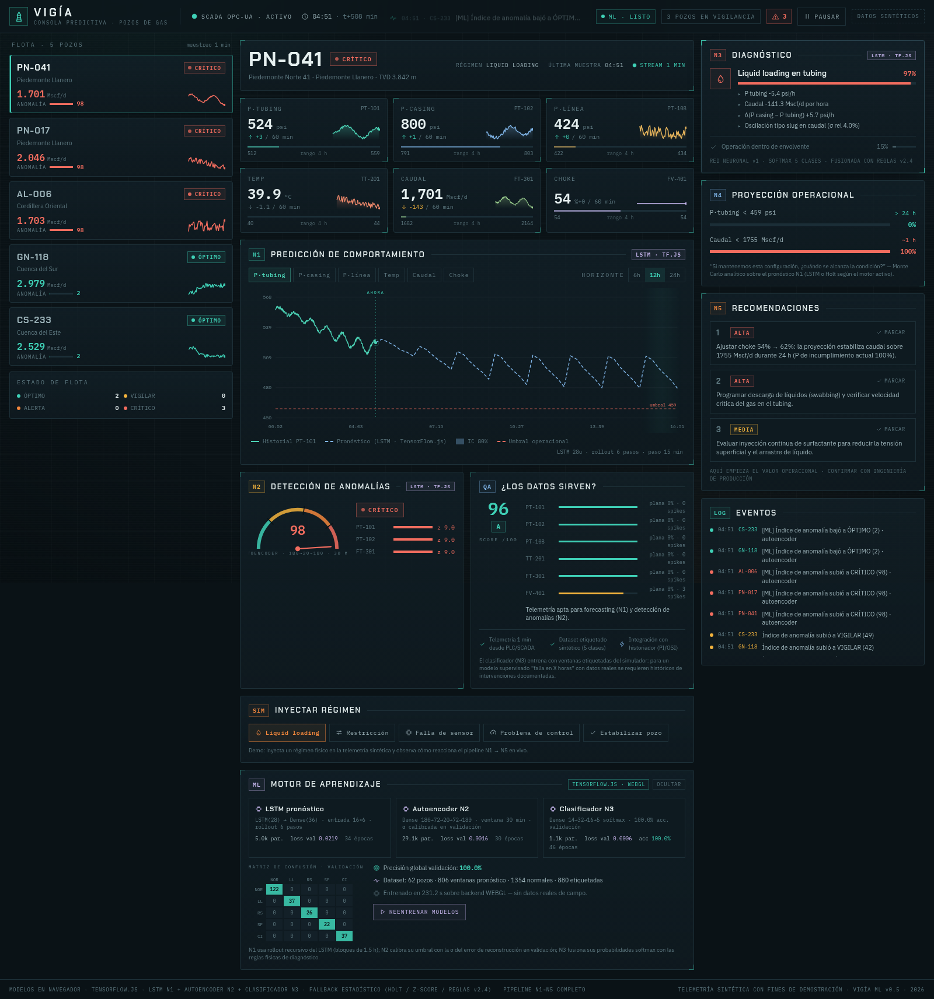
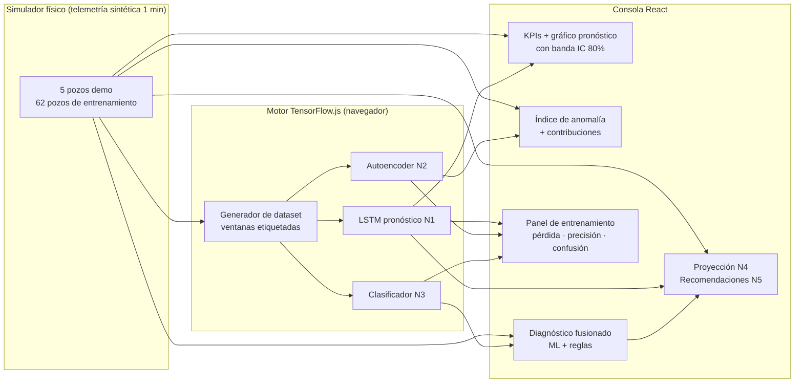
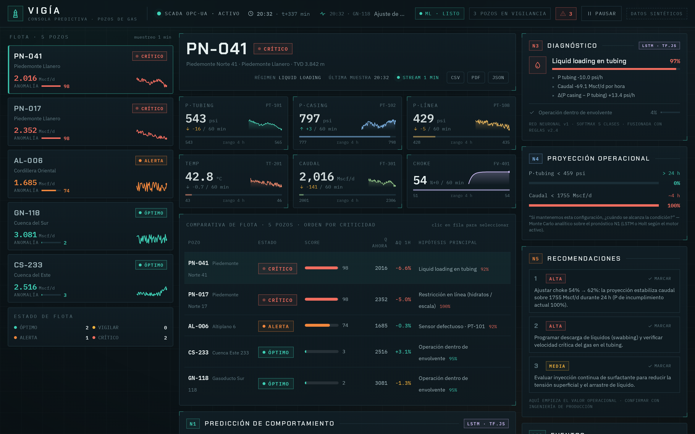

<div align="center">

# VIGÍA ML

**Consola predictiva de pozos de gas con Machine Learning en el navegador**

[](https://react.dev)
[](https://www.typescriptlang.org)
[](https://www.tensorflow.org/js)
[](https://vitejs.dev)
[](https://tailwindcss.com)
[](LICENSE-AL-1.0)
[](https://github.com/eddyflores100-lang/vigia-ml/actions/workflows/ci.yml)
[](#scripts)
[](https://github.com/eddyflores100-lang/vigia-ml/releases)
[](https://github.com/eddyflores100-lang/vigia-ml/discussions)

*Pronóstico LSTM · Detección de anomalías con autoencoder · Clasificación de fallas con red neuronal — todo entrena y ejecuta **en vivo** en tu navegador, sin servidor.*

> ▶️ **Demo en vivo: [eddyflores100-lang.github.io/vigia-ml/](https://eddyflores100-lang.github.io/vigia-ml/)** — sin instalación: abre el enlace y los modelos se entrenan en tu navegador.

</div>

---

## ¿Qué es VIGÍA ML?

VIGÍA ML es una consola de operación para campos de gas que combina **tres modelos de machine learning** con un pipeline de análisis de telemetría SCADA (1 min por muestra). A diferencia de un dashboard tradicional, aquí los modelos **entrenan en tu navegador al abrir la página** (TensorFlow.js/WebGL) y luego asumen el control del pipeline analítico capa por capa, con **fallback estadístico** garantizado mientras tanto.

La telemetría es **sintética**: un simulador físico de pozos genera series minuto a minuto con regímenes operativos inyectables (liquid loading, restricción en línea, falla de sensor, problema de actuador), lo que permite demostrar el ciclo completo *datos → entrenamiento → inferencia → recomendación* sin datos reales de campo.


## Pipeline analítico (N1 → N5)

| Capa | Función | Motor ML | Fallback estadístico |
|------|---------|----------|----------------------|
| **N1 · Pronóstico** | Proyección multivariada a 6/12/24 h con IC 80% | **LSTM(28)** sobre agregados de 15 min, rollout recursivo de 6 pasos | Holt amortiguado (α=0.32, β=0.11, φ=0.93) |
| **N2 · Anomalías** | Índice 0–100 por pozo con contribuciones por variable | **Autoencoder denso** 180→72→20→72→180, error de reconstrucción calibrado en validación | z-score multivariable, ventana 120 min |
| **N3 · Diagnóstico** | Hipótesis de falla con evidencia física | **Clasificador denso** 20→32→16→5 softmax entrenado con ~1.1k ventanas etiquetadas | Reglas físicas v2.4 (23 patrones) |
| **N4 · Proyección** | P(cruce de umbral en 24 h) + hora estimada | Monte Carlo analítico sobre el pronóstico del LSTM | Ídem sobre Holt |
| **N5 · Recomendaciones** | Acciones operacionales priorizadas (ALTA/MEDIA/RUTINA) | Derivadas del diagnóstico fusionado ML + reglas | Ídem |

### Los tres modelos en detalle

1. **LSTM de pronóstico (N1)** — Recibe ventanas de 16 pasos × 6 variables (P tubing, P casing, P línea, temperatura, caudal, choke) normalizadas por pozo y predice los siguientes 6 pasos de 15 min para las 6 variables a la vez (36 salidas). Para horizontes largos aplica *rollout recursivo*: realimenta sus propias predicciones. La incertidumbre se calibra con la σ de residuales por (paso, variable) medida en validación, y crece con √(bloques de rollout).

2. **Autoencoder de anomalías (N2)** — Entrena **solo con operación normal** para reconstruir ventanas de 30 min. En producción, el error de reconstrucción se convierte en score 0–100 mediante la distribución (μ, σ) del error en validación. Las contribuciones por variable revelan *qué señal* está anómala. Un detector de señal congelada complementa al AE (una señal plana es trivial de reconstruir pero es falla clara del transmisor).

3. **Clasificador de diagnóstico (N3)** — Extrae 20 features físicas por ventana de 90 min (tendencias por hora, diferenciales de presión, oscilación de caudal, recorrido del choke, planitud de señal, spikes, desfases de nivel respecto a la línea base y apertura del diferencial casing−tubing) y las pasa por una red softmax de 5 clases. Los desfases de nivel y el diferencial casing−tubing permiten detectar regímenes **ya saturados** (cuando las pendientes vuelven a cero); esas ventanas además se sobremuestrean en el set de entrenamiento. Su salida se **fusiona con las reglas físicas**: la red da la probabilidad, las reglas aportan la evidencia textual que el operador puede auditar.

### Dataset de entrenamiento

Se generan **52 pozos sintéticos** con bases operativas aleatorias y regímenes inyectados en un minuto aleatorio de los primeros 60–120. De cada pozo se extraen ~680 ventanas de pronóstico, ~820 ventanas normales (autoencoder) y ~1.1k ventanas etiquetadas (clasificador, con oversampling de las saturadas), con split train/validación **por pozo** para evitar fuga de datos y balanceo de la clase normal. Todo determinista (seed fija).

### Entrenamiento sin bloqueos

El bucle de entrenamiento **nunca congela la pestaña**: en lugar de `model.fit()`, el motor entrena **lote a lote** con `trainOnBatch()` y cede el hilo principal (`tf.nextFrame`) entre lote y lote — puedes seguir explorando la consola mientras entrena, y cancelar con el botón **DETENER** en cualquier momento. Además:

- **Sonda de WebGL**: si el backend declarado no computa, cae automáticamente a CPU.
- **Modo ligero en CPU**: mitad de dataset y épocas reducidas (~18 s de entrenamiento) frente al modo WebGL completo (~5–10 s).
- **Presupuesto de tiempo** por fase: si un modelo excede su cupo, termina antes con lo aprendido (sin bloquear la consola).
- **Inferencia espaciada**: la inferencia en vivo (autoencoder + clasificador + rollout LSTM) corre cada 3 s, no en cada tick de telemetría.

## Demo rápida

```bash
git clone https://github.com/eddyflores100-lang/vigia-ml.git
cd vigia-ml
npm install
npm run dev          # abre http://localhost:3000
```

Al abrir la consola verás:

1. **El panel "Motor de aprendizaje"** entrena los 3 modelos en vivo (~5–10 s con WebGL; ~18 s si tu navegador cae a CPU, sin congelar la interfaz). Curva de pérdida, épocas y precisión en tiempo real — y botón **DETENER** si prefieres saltarlo.
2. Cada modelo **toma el control de su capa** al terminar (los chips `LSTM · TF.JS` se encienden en N1/N2/N3).
3. Con el motor listo, la **matriz de confusión** y las métricas de validación quedan visibles; puedes **reentrenar** con un clic.
4. Selecciona un pozo y **inyecta un régimen** (p. ej. *Liquid loading*): en ~1 minuto el clasificador ML lo detectará con su probabilidad, el autoencoder subirá el índice de anomalía y N5 propondrá acciones. El diagnóstico se mantiene estable incluso cuando el régimen se **satura** (los desfases de nivel siguen señalando la falla).



## Arquitectura



```
src/
├── lib/
│   ├── sim.ts                 # simulador físico de pozos + flota demo
│   ├── models.ts              # pipeline estadístico (Holt, z-score, reglas, N4/N5)
│   └── ml/
│       ├── dataGen.ts         # dataset de entrenamiento (ventanas etiquetadas)
│       └── engine.ts          # motor TF.js: 3 modelos + entrenamiento + inferencia
└── components/
    ├── ForecastChart.tsx      # N1 · historia + pronóstico LSTM/Holt con IC
    ├── InsightPanels.tsx      # N2 · medidor de anomalía + calidad de datos
    ├── RightRail.tsx          # N3/N4/N5 · diagnóstico, proyección, recomendaciones
    ├── TrainingPanel.tsx      # ML · entrenamiento en vivo + matriz de confusión
    └── ...                    # TopBar, WellRail, KpiGrid, bits
```

## Scripts

| Comando | Descripción |
|---------|-------------|
| `npm run dev` | Servidor de desarrollo (Vite, puerto 3000) |
| `npm run build` | Build de producción (`dist/`) |
| `npm run preview` | Sirve el build de producción localmente |
| `npm run typecheck` | Verificación de tipos TypeScript |
| `npm test` | Pruebas unitarias (Vitest, 39 tests) |
| `npm run test:watch` | Pruebas en modo watch |

## Qué hay de nuevo en v0.7.0



- **Motor ML en un Web Worker**: el entrenamiento (N1 LSTM + N2 autoencoder + N3 clasificador) y la inferencia ahora corren **fuera del hilo principal** — la interfaz mantiene 60 fps durante el entrenamiento aunque el navegador caiga al backend CPU. Fábrica `createEngine()` con fallback automático al hilo principal en entornos sin module workers. Se corrigió además una fuga sutil: reentrenar terminaba el motor anterior con `abort` pero sin liberar su worker.
- **Comparativa de flota (multi-pozo)**: nueva tabla `Comparativa de flota` ordenada por criticidad con estado, score de anomalía, caudal actual, tendencia de caudal a 1 h e hipótesis de diagnóstico principal de los 5 pozos — un clic en la fila selecciona el pozo.
- **Reporte PDF imprimible**: botón **PDF** que abre un reporte operativo A4 (anomalía, diagnóstico con evidencia, proyección N4, recomendaciones N5, calidad de datos y eventos) listo para *Guardar como PDF* desde el diálogo nativo del navegador — sin dependencias añadidas. Si el navegador bloquea la ventana, cae a la descarga JSON.
- **Atajos de teclado**: `1`–`5` selecciona pozo · `P` pausa/reanuda el stream · `C` cicla la variable del gráfico.
- **A11y**: los botones de exportación exponen `aria-label`.

## Qué hay de nuevo en v0.6.0

- **Suite de pruebas unitarias (Vitest)**: 36 tests cubren el simulador (determinismo, escenarios, límites del buffer), la capa analítica N1–N5 (Holt amortiguado, Φ normal, proyecciones, anomalías, diagnóstico, recomendaciones, calidad de datos) y el generador de datasets ML (formas, determinismo, sin fuga de datos por pozo). El CI ejecuta typecheck + tests + build en cada push.
- **Fallback N3 reforzado**: nueva rama de **liquid loading establecido** — cuando el régimen ya está saturado y las tendencias se aplanan, el diagnóstico estadístico ahora detecta la oscilación tipo slug persistente (σ de caudal > 3 % + oscilación de P·tubing > 4 psi), replicando las señales que usa el clasificador ML (`ptOsc`/`gapOff`).
- **Guardia de saneamiento de datos**: toda muestra pasa por `sanitizeSample()` en el único punto de entrada al buffer — NaN/Infinity se sustituyen por valores finitos dentro de rangos físicos, protegiendo al pipeline estadístico y a los modelos TF.js de datos corruptos.
- **ErrorBoundary de React**: un fallo de render degrada a un panel de contingencia con botón de recuperación en vez de dejar la consola en blanco.
- **PWA instalable y offline**: manifest + service worker (stale-while-revalidate para assets, network-first para navegaciones, fuentes cacheadas). Instálala desde el navegador y ábrela sin conexión.
- **Exportación de datos**: botones **CSV** (telemetría completa, BOM UTF-8 compatible con Excel) y **JSON** (reporte operativo: anomalía, diagnóstico, proyección N4, recomendaciones N5, calidad de datos y eventos) en la cabecera del pozo.

## Despliegue

La app es 100% estática (todo el ML corre en el navegador), así que se despliega gratis en cualquier hosting:

| Plataforma | Cómo | URL resultante |
|------------|------|----------------|
| **GitHub Pages** | Ya configurado: el workflow `.github/workflows/deploy.yml` publica en cada push a `main` | [eddyflores100-lang.github.io/vigia-ml](https://eddyflores100-lang.github.io/vigia-ml/) |
| **Vercel** | Importa el repo en [vercel.com/new](https://vercel.com/new) → framework **Vite** detectado automáticamente (config extra en `vercel.json`) | `vigia-ml.vercel.app` |
| **Cloudflare Pages** | En [pages.cloudflare.com](https://pages.cloudflare.com) → *Connect to Git* → build `npm run build`, salida `dist` | `vigia-ml.pages.dev` |

> **Supabase** no aloja la app (es backend), pero es el complemento natural cuando quieras persistir telemetría real de campo: la tabla `samples` alimentaría los mismos modelos en lugar del simulador.

## Detalles técnicos

- **Backend de cómputo**: TensorFlow.js selecciona WebGL automáticamente (con sonda de verificación); si no está disponible cae a CPU con dataset y épocas reducidos para mantener un tiempo de entrenamiento razonable.
- **Memoria**: todos los tensores de inferencia se liberan tras cada ciclo (1.5 s); los modelos viven durante toda la sesión y se liberan al reentrenar o desmontar.
- **Degradación elegante**: si la inferencia ML falla o el motor aún entrena, cada capa usa su gemelo estadístico — la consola nunca se queda sin análisis.
- **Reproducibilidad**: el dataset usa semillas fijas; con el mismo navegador obtendrás las mismas curvas de entrenamiento (salvo la no-determinidad propia de WebGL).
- **Normalización por pozo**: cada modelo normaliza las variables respecto a la base operativa del pozo (escala relativa por variable), lo que permite entrenar con pozos sintéticos y aplicar a pozos con bases distintas.

## Limitaciones (honestidad ante todo)

- La telemetría es **sintética**: los niveles de precisión mostrados (≥95% en validación) reflejan la separabilidad de los regímenes del simulador, no la de un campo real.
- Un modelo supervisado de *falla en X horas* con datos reales requiere históricos de intervenciones documentadas.
- El rollout recursivo del LSTM acumula deriva a 24 h; las bandas de confianza crecen con √(bloques) para reflejarlo.

## Retroalimentación y comunidad

Este proyecto busca validación de ingenieros de producción, analistas de operaciones y practicantes de ML industrial:

- 💬 **[Discussions](https://github.com/eddyflores100-lang/vigia-ml/discussions)** — preguntas, ideas de nuevas fallas para el simulador, y sobre todo retroalimentación operacional: ¿las hipótesis de diagnóstico y las recomendaciones N5 reflejan lo que verías en campo?
- 🐛 **[Issues](https://github.com/eddyflores100-lang/vigia-ml/issues)** — bugs o problemas de reproducibilidad.
- ⭐ Si la consola te resulta útil para enseñar o demostrar analítica de producción, una estrella ayuda a que más gente la encuentre.

## Licencia

[AliceLabs Source-Available License v1.0 (AL-1.0)](LICENSE-AL-1.0) — el código es inspeccionable y ejecutable libremente para uso no comercial (aprendizaje, investigación académica, auditorías de seguridad). El uso comercial, la redistribución y los forks públicos requieren autorización escrita de AliceLabs LLC: `legal@alicelabs.site`.

---

<div align="center">
<sub>VIGÍA ML v0.7.0 · Telemetría sintética con fines de demostración · Entrena, vigila, recomienda.</sub>
</div>
